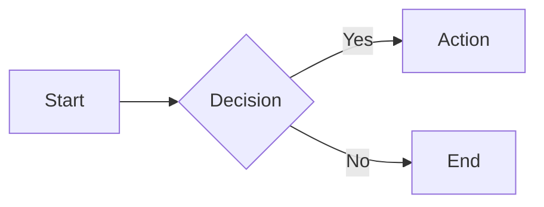

# Syntax
[TOC]

## Essential Format Syntax

### Headers
Use headers to structure your presentation:
```markdown
# Presentation Title
## Slide Title
### Subtopic
```

### Text Formatting
Emphasize key points:
- *Italic*: `*italic*` or `_italic_`
- **Bold**: `**bold**` or `__bold__`
- <->Bold and Italic<->: `<->bold and italic<->`

### Lists
Organize information clearly:

Unordered lists:
```markdown
- Main point
  - Supporting detail
  - Another detail
```

Ordered lists:
```markdown
1. First step
2. Second step
   1. Substep A
   2. Substep B
```

### Links and Images
Enhance slides with visual elements:
- Links: `[Link text](URL)`
- Images: ``

### Blockquotes
Highlight important quotes:
```markdown
> This is a key takeaway or quote.
```

## Advanced Format Features

### Code Blocks
Showcase code snippets:
````markdown
```python
def greet(name):
    print(f"Hello, {name}!")
```
````

### Tables
Present structured data:
```markdown
| Feature | Benefit |
|---------|---------|
| Easy    | Saves time |
| Flexible| Adaptable  |
```

### Task Lists
Show progress or plans:
```markdown
- [x] Completed task
- [ ] Upcoming task
```

### LaTeX
Include mathematical expressions:
- Inline: `$E = mc^2$`
- Block:
  ```markdown
  $$
  \frac{d}{dx}e^x = e^x
  $$
  ```

### Mermaid Diagrams
Visualize processes or structures:
````markdown

````

### Callouts
Highlight important information:
```markdown
> [!NOTE]
> This is an important point to remember.

> [!TIP]
> Here's a helpful suggestion.
```

## Slide Layout Syntax

### Creating New Slides

#### Using Headers
Each header starts a new slide:
```markdown
## Slide 1: Introduction
Content for first slide

## Slide 2: Key Points
Content for second slide
```

#### Using Horizontal Rules
Manually create slides with `---`:
```markdown
Content for slide 1

---

Content for slide 2
```

### In-slide Layout

#### Horizontal Separation
Create columns with `<->`:
```markdown
Left column content
<->
Right column content
```

#### Vertical Separation
Stack content with `===`:
```markdown
Top section
===
Bottom section
```

#### Combined Layouts
Create complex layouts:
```markdown
Top row
===
Left column
<->
Right column
===
Bottom row
```

### Layout Best Practices

1. Use consistent formatting across slides.
2. Balance text and visuals for engagement.
3. Utilize white space to avoid clutter.
4. Preview slides regularly to ensure intended layout.

Remember, effective slides combine clear organization with visual appeal. Experiment with layouts to find what best suits your presentation style and content.
